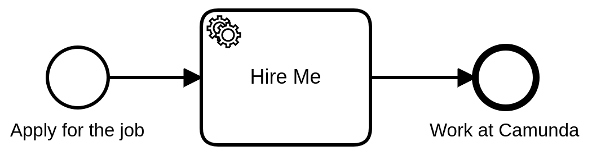

# Camunda QA Engineer Remote Test Challenge

Welcome to the Camunda QA Engineer Remote Test Challenge. For this exercise you have to test a new feature in our process monitoring application [Operate](https://docs.camunda.io/docs/components/operate/) which is part of the [Camunda Cloud Platform](https://docs.camunda.io/).  

In the following steps you will learn how to connect to the Camunda Cloud, deploy a process, start a process instance and observe the result in the Operate app.   
Before we dive into the technical details let's have a look at the process that we automate.

The [process](https://docs.camunda.io/docs/components/concepts/processes/) basically describes our hiring process with the help of [BPMN](https://docs.camunda.io/docs/components/modeler/bpmn/bpmn-primer/). Once a candidate applys for the job the process will be started. The following [service task](https://docs.camunda.io/docs/components/modeler/bpmn/service-tasks/) triggers a [worker](https://docs.camunda.io/docs/components/concepts/job-workers/) that is capable of performing a particular task in our process. Once the task has been processed, the end event will be reached and the execution path ends.

## Sign up for Camunda Platform 8

Visit [camunda.io/signup](https://accounts.cloud.camunda.io/signup) to create a new account. After login, you'll see the console overview page. This is the central place to manage your clusters.

Docs: https://docs.camunda.io/docs/guides/getting-started/


### Create a new Cluster

You must create a cluster if you have a new Camunda Platform 8 account.  

1. To create a cluster, click the Clusters tab, and click Create New Cluster.
2. Name your cluster. For the purpose of this guide, we recommend using the Stable channel, the latest generation, and the region closest to you. Click Create.
3. Your cluster will take a few moments to create. Check the satus on the Clusters page or by clicking into the cluster itself and looking at the Applications Overview.


### Create credentials for your Zeebe client

To interact with your Camunda Platform 8 cluster, you'll use the Zeebe client. First, you'll need to create credentials.  

1. The main page for Console should be open on another tab. Use Console to navigate to your clusters either through the navigation Clusters or by using the section under View all on the Clusters section of the main dashboard. Click on your existing cluster. This will open the Overview for your cluster, where you can find your cluster id and region. You will need this information later when creating a worker in the next section.
2. Navigate to the API tab. Click Create.
3. Provide a descriptive name for your client. For this challenge, the scope can be the default Zeebe scope. Click Create.
4. Your client credentials can be downloaded at this point. You will need your client id and your client secret when creating a worker in the next section. Furtermore you have to look up the cluster id which can be found in the connection information of your client.


## Build a Process Application

For this exercise we use java script and the [node.js client](https://github.com/camunda/camunda-platform-get-started/tree/main/nodejs). 

### Install Dependencies


The open source library [zeebe-node](https://www.npmjs.com/package/zeebe-node) provides a Zeebe client.

```
npm install --save zeebe-node
```


### Connect your code to the cluster 

If we want to connect to a Camunda Platform 8 cluster we need the `clusterId` from the [Clusters details page](https://docs.camunda.io/docs/components/console/manage-clusters/create-cluster/), a `clientId` and `clientSecret` from a [client credentials pair](https://docs.camunda.io/docs/components/console/manage-clusters/manage-api-clients/) (as described above).


```javascript
const { ZBClient } = require('zeebe-node')

const zbc = new ZBClient({
	camundaCloud: {
		clusterId: '365eed98-16c1-4096-bb57-eb8828e6661e',
		clientId: 'GZVK3ALYy~qCcD3MYq~sf0GIszNzLE_z',
		clientSecret: '.RPbZc6q0d6uzRbB4LW.B8lCpsxbBEpmBX0AHQGzINf3.KK9RkzZW1aDaZ-7WYNJ',
	},
})
```

### Deploy Process and Start Instance

To deploy a process use the following command and specify the filepath of the BPMN file.

```
await zbc.deployProcess(['../resources/hiring-process.bpmn'])
```

To start a new instance you have to specify the `bpmnProcessId`, i.e. `hiring-process` (which is defined in the BPMN file). Furthermore it is possible to add [process variables](https://docs.camunda.io/docs/components/concepts/variables/). Variables are part of a process instance and represent the data of the instance. 

```
const result = await zbc.createProcessInstance('hiring-process', {
	message_content: 'Hello from the Camunda remote test challenge',
})
console.log(result)
```

In this code snippet we start an instance of the process definition with the `bpmnProcessId`: `hiring-process` and additionaly create a process variable called *message_content* that contains a string as a value.

For the complete code see the [`deploy-and-start-instance.js`](deploy-and-start-instance.js) file. To run it use the following command.

```bash
node deploy-and-start-instance.js
```

You can now monitor your instances in [Operate](https://docs.camunda.io/docs/components/operate/). Open the cluster overview in the Console app and launch Operate. In the processes view you will see the process model, a table with running process instances and a filter panel on the left. All instances should be running, visualized with a green token waiting in the Service Task with the name **Hire Me**.  
By selecting the process instance ID in the list of instances you can drill down to a single instance. In this view it is possible to retrieve the process variables.

### Job Worker

In the next step we will spin up a [job worker](https://docs.camunda.io/docs/components/concepts/job-workers/). This is a pice of code connected to the [Service Task](https://docs.camunda.io/docs/components/modeler/bpmn/service-tasks/) in our process, capable of performing a particular task. In our process we will simply print out the variable which we added while starting the process instance.  
To complete a service task, a job worker has to be subscribed to the task type defined in the process, i.e. hiring.  

```
zbc.createWorker({
	taskType: 'hiring',
	taskHandler: (job, _, worker) => {
		const { message_content } = job.variables
		worker.log(`Message: ${message_content}`)
		job.complete()
	}
})
```

Start the worker and navigate to Operate and you will see your token has moved to the end event, completing the process instance.

```bash
node orchestrate-hiring.js
```

As long the worker is runnning it will automatically request jobs, in our case of the type 'hiring'. That means, whenever we start a new instance of our process and the process token reaches the services task our worker will do the job.  

Congratulations, you have automated a process!


## Test Challenge

In the section above you have learned how to prepare your test setup. We will now ask you to test a new feature manually in our process monitoring application [Operate](https://docs.camunda.io/docs/components/operate/). The feature is specified in the following [issue](https://github.com/mschoe/qa-remote-challenge/issues/1).

This is your task:
1. Transfer the requirements into detailed, comprehensive and well-structured manual test cases.
2. Could you suggest any improvements for the given requirements in the ticket?
3. If you identify issues or potential improvements, please describe the bug/improvement and provide the steps to reproduce.
4. Adjust the test setup according to your needs (for example to be able to start multiple instances or create variables with random values) and add the new code to the result. 

Please provide the result as a shared GitHub repo or send it as text/pdf file via mail. 

### Additional Hints

Please note that this is an open-ended test designed to show us your level of proficiency, there is no binary result.
Please complete it within 7 days from now. We will then review your work and get back to you, typically within 3 working days. The next step will be a ~ 30-minute phone/video call to get to know you personally.

Happy testing! 
